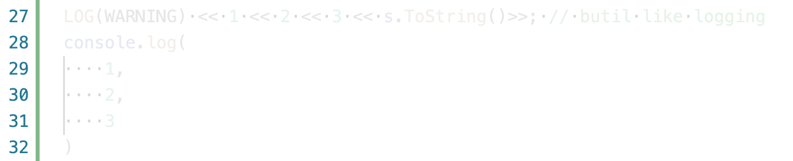

# lowlight-block README

lowlight-block is intended to low light not necessary code for better code reading and development. For example, 

```cpp
Status s = f(arg1, arg2, arg3);
LOG(WARNING) << s.ToString();
```

the extension is intended to low light code like `LOG(WARNING) << s.ToString()`. Not just logging, the logic code changing from time to time, we may low light some code that is not important and focus on the main.

## Features

Currently, the extension support:

1. search code by regex, then find range depends on `(),{},[]`, and lowlight the codd

```
{
    "lowlight-block.rules": [
        "LOG",
        "console.log"
    ]
}
```



## Extension Settings


* `lowlight-block.rules`: currently a list of string to match